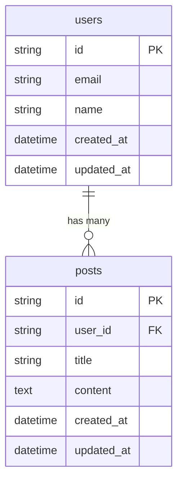

---
paths:
  - "src/db/**/*.ts"
  - "prisma/**/*"
  - "drizzle/**/*"
---

# Database Rules

## スキーマ設計

### Do
- テーブル名はスネークケース・複数形にする
- すべてのテーブルに `id`, `created_at`, `updated_at` カラムを持たせる
- カラム名はスネークケースにする

### Don't
- テーブル名をキャメルケースや単数形にしない

### Example
```prisma
// Good
model users {
  id         String   @id @default(cuid())
  first_name String
  created_at DateTime @default(now())
  updated_at DateTime @updatedAt
}

// Bad
model User {
  id        String @id
  firstName String       // キャメルケース
  // created_at, updated_at なし
}
```

## クエリ

### Do
- ORM（Prisma / Drizzle 等）を使用する
- 関連データは `include` / `with` で事前に取得して N+1 を防ぐ
- 大量データの取得にはページネーションを実装する

### Don't
- 生SQLを直接書かない（パフォーマンス上やむを得ない場合を除く）
- ループ内でクエリを発行しない

### Example
```ts
// Good
const users = await prisma.user.findMany({
  include: { posts: true },
  take: 20,
  skip: page * 20,
});

// Bad
const users = await prisma.user.findMany();
for (const user of users) {
  user.posts = await prisma.post.findMany({ where: { userId: user.id } }); // N+1
}
```

## マイグレーション

### Do
- スキーマ変更は必ずマイグレーションファイルを通して行う
- マイグレーションは後方互換性を保つ（カラム削除は段階的に行う）

### Don't
- マイグレーションファイルを手動で編集しない
- 本番DBを直接変更しない

### Example
```bash
# Good - マイグレーション経由でスキーマ変更
pnpm prisma migrate dev --name add_user_role

# Bad
# 本番DBに直接SQL実行
# ALTER TABLE users ADD COLUMN role VARCHAR(255);
```

## ER図

### Do
- スキーマ変更時は `docs/er-diagram.md` のER図をMermaid記法で作成・更新する
- すべてのテーブルとリレーションを含め、全体像を把握できる状態を維持する
- カラムには型を明記し、PK・FK を区別する

### Example
````markdown

````

## セキュリティ

### Do
- パラメータバインディングを使う
- 機密データ（パスワード等）はハッシュ化して保存する
- データベース接続情報は環境変数で管理する

### Don't
- ユーザー入力を直接クエリに埋め込まない
- パスワードを平文で保存しない
- 接続情報をコードにハードコードしない

### Example
```ts
// Good
const user = await prisma.user.findUnique({ where: { email } });

// Bad
const user = await prisma.$queryRawUnsafe(`SELECT * FROM users WHERE email = '${email}'`);
```
