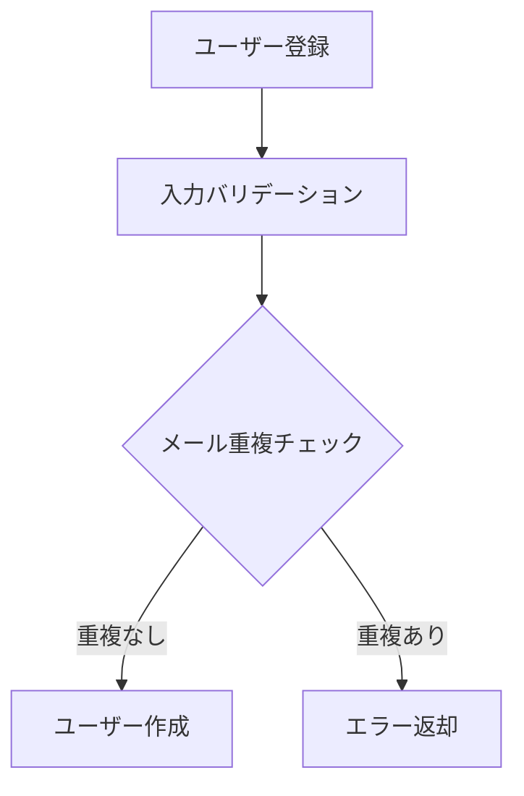

---
paths:
  - "README.md"
  - "README.ja.md"
  - "**/README.md"
  - "**/README.ja.md"
  - "docs/**/*"
---

# Documentation Rules

## 多言語対応

### Do
- README は `README.md`（英語）と `README.ja.md`（日本語）の2ファイルを作成する
- 両ファイルの冒頭に言語切り替えリンクを記載する

### Don't
- 片方の言語だけ更新して、もう片方を放置しない

### Example
```html
<!-- README.md の冒頭 -->
<p align='center'>
  English | <a href='./README.ja.md'>日本語</a>
</p>

<!-- README.ja.md の冒頭 -->
<p align='center'>
  <a href='./README.md'>English</a> | 日本語
</p>
```

## ドキュメント配置方針（ハイブリッド）

### Do
- **ルート `README.md` / `README.ja.md`**: プロジェクト概要、セットアップ手順、技術スタック、コントリビューションガイドを記載する
- **各ディレクトリの `README.md` / `README.ja.md`**: そのディレクトリの責務、構成、主要モジュールの説明を記載する
- **`docs/`**: 特定ディレクトリに属さないドキュメントを配置する

### Don't
- `docs/` だけにドキュメントを集約しない（コードの近くにも置く）
- ディレクトリの README を省略しない

### Example
```
# Good - コードの近くにも README を配置
src/features/user/
  ├── README.md             # user feature の説明
  ├── service/
  └── repository/

docs/
  ├── requirements.md       # プロジェクト全体の要件
  └── architecture.md       # 全体設計

# Bad - docs/ にすべて集約
docs/
  ├── user-feature.md
  ├── auth-feature.md
  └── ...
src/features/user/          # README なし
```

## 各ディレクトリ README の対象

### Do
- 以下のディレクトリには `README.md` を設置する:
  - `src/components/` - コンポーネントの設計方針・分類
  - `src/hooks/` - カスタムhooksの一覧・使い方
  - `src/services/` - サービス層の責務・依存関係
  - `src/app/api/` または `src/pages/api/` - APIエンドポイント一覧

### Example
```markdown
# src/features/user/

ユーザー管理に関する機能を提供します。

## 構成
| ディレクトリ | 責務 |
|---|---|
| `api/` | ユーザー関連の API Route |
| `service/` | ユーザーのビジネスロジック |
| `repository/` | ユーザーの DB アクセス |
```

## 図表の記法

### Do
- フロー・ワークフロー・ER図などの図表はすべてMermaid記法で記述する
- 機能やドメインごとのワークフロー（例: ユーザー登録フロー、決済フロー等）は `docs/` 内にMermaidで作成・管理する

### Don't
- 画像で図表を管理しない（更新しづらい）

### Example
````markdown

````

## ディレクトリツリー

### Do
- ルート `README.md` にはプロジェクト全体のディレクトリツリーを記載する
- ディレクトリ構成が変わったら必ずツリーも更新する
- 主要なディレクトリ・ファイルにはコメントで役割を添える

### Don't
- ツリーを古いまま放置しない

### Example
```markdown
## Directory Structure
├── src/
│   ├── features/       # 機能ごとのモジュール
│   ├── shared/         # 共通コンポーネント・hooks
│   └── lib/            # 外部ライブラリのラッパー
├── docs/               # プロジェクトドキュメント
└── CLAUDE.md           # コーディング原則
```

## 記載内容

### Do
- 新しいディレクトリやモジュールを追加したら、対応する README も作成・更新する
- README には「なぜそうしたか（Why）」を重視して書く
- セットアップ手順は初めて触る人が迷わないレベルで書く
- 重要な注意事項や警告には GitHub の Alerts 記法を使用する

### Don't
- 「何か（What）」だけを書かない（コードを読めばわかる）
- 警告すべき内容を通常のテキストに埋もれさせない

### Example
```markdown
> [!NOTE]
> 補足情報

> [!TIP]
> 便利なヒント

> [!IMPORTANT]
> 重要な情報

> [!WARNING]
> 注意が必要な内容

> [!CAUTION]
> 守らないと問題が起きる内容
```

## 詳細ドキュメント（`.wiki/`）

### Do
- DeepWiki のようなコードベース全体の詳細ドキュメントは `.wiki/` ディレクトリに生成・管理する
- `.wiki/` は `.gitignore` に追加する
- ローカル環境でのコード理解・オンボーディング用途として活用する

### Don't
- `.wiki/` をリポジトリにコミットしない

### Example
```gitignore
# .gitignore
.wiki/
```

## メンテナンス

### Do
- コードの構成変更時は関連する README も合わせて更新する
- 古くなった記述は削除または修正する

### Don't
- ドキュメントの更新を後回しにしない

### Example
```markdown
<!-- Good - コード変更と同じ PR でドキュメントも更新 -->
feat: add user deletion API

- Add DELETE /api/users/[id]
- Update docs/api-specification.md  ← 同時に更新
- Update docs/er-diagram.md         ← 同時に更新
```
